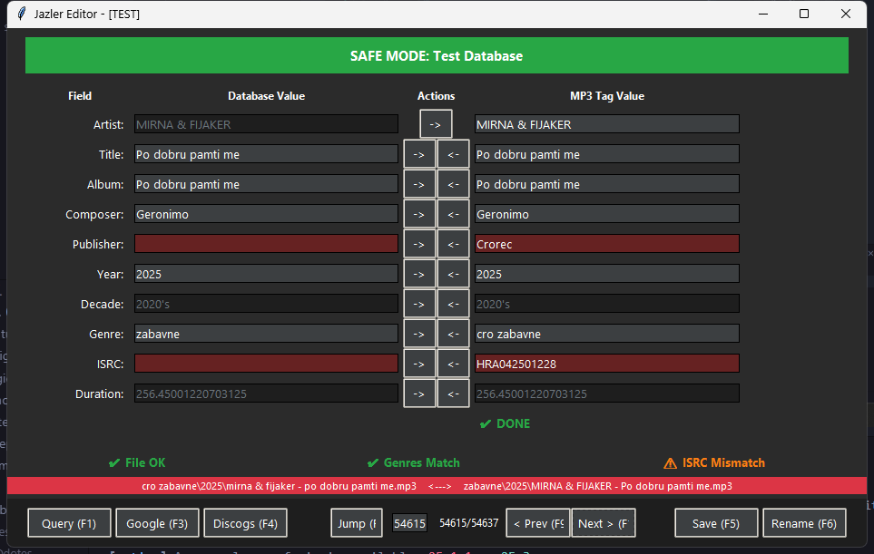

# MS Access Database Editor

A modern Python application for managing and editing MS Access database entries with ID3 tag synchronization.



## Features

- 🎵 **Dual Database Support** - Switch between Live and Test databases
- 🔍 **Smart Search** - Query songs by artist, title, album, and more
- 🏷️ **ID3 Tag Sync** - Automatic synchronization between database and MP3 tags
- ✅ **Field Validation** - Intelligent validation with visual feedback
- 📁 **File Management** - Automatic file path generation and validation
- 🎨 **Modern UI** - Dark theme with intuitive controls
- 💾 **Position Memory** - Remembers your last position and query
- 🎯 **Genre Rules** - Configurable genre-based folder organization

## Quick Start

### Prerequisites

- Python 3.10+
- Access to MS Access database (`.accdb` file)
- Windows OS (for database connectivity)

### Installation

1. Clone the repository:
```bash
git clone https://github.com/PROdotes/ms_database_sync_app.git
cd ms_database_sync_app
```

2. Install dependencies:
```bash
pip install -r requirements.txt
```

3. Run the application:
```bash
python run.py
```

### Building Standalone EXE

```bash
build_exe.bat
```

The executable will be created in `dist\DatabaseEditor.exe`

## Configuration

The application uses `config.json` for configuration:

- **Database Paths** - Live and test database locations
- **Drive Mapping** - Map network drives (e.g., `b:` → `z:`)
- **Genre Rules** - Custom folder organization rules
- **Last Query** - Automatically saved query and position

See [CONFIG_LOCATION.md](CONFIG_LOCATION.md) for details on config file placement.

## Usage

### Database Selection

On startup, choose between:
- **Test Database** (default, safer) - For testing changes
- **Live Database** - Production database (use with caution)

### Editing Songs

1. **Search** - Use F1 or Query button to search for songs
2. **Navigate** - Use Next/Prev buttons or F9/F10 keys
3. **Edit** - Modify fields in the ID3 column
4. **Validate** - Visual feedback shows field status
5. **Save** - F5 to save, F6 to save and rename file

### Keyboard Shortcuts

| Key | Action |
|-----|--------|
| F1  | Open Query Dialog |
| F3  | Google Search |
| F4  | Discogs Search |
| F5  | Save Changes |
| F6  | Save and Rename |
| F9  | Previous Song |
| F10 | Next Song |
| F11 | Jump to Position |

## Field Comparison Logic

### Artist Field
Uses **startswith** comparison to handle database character limits:
- Database: `"The Beatles"`
- ID3 Tag: `"The Beatles feat. Special Guest"` ✅ Valid

### Other Fields
Exact match required for title, album, composer, publisher, year, ISRC.

### Genre Matching
- Partial matching supported (e.g., "Zabavne" matches "Cro Zabavne")
- Special exclusion: "za obradu" is optional in ID3
- Only first 3 database genres validated

## Project Structure

```
ms_database_sync_app/
├── src/
│   ├── core/           # Database and config management
│   ├── models/         # Data models (Song, SongID3)
│   ├── ui/             # User interface
│   └── utils/          # Audio and helper utilities
├── tests/              # Comprehensive test suite (67 tests)
├── screenshots/        # Application screenshots
├── config.json         # Configuration file
└── run.py             # Application entry point
```

## Testing

Run the test suite:
```bash
pytest tests/ -v
```

Current test coverage: **67 tests**, 100% passing

## Development

### Code Quality

- ✅ Type hints throughout
- ✅ Comprehensive test coverage
- ✅ Clean separation of concerns
- ✅ SOLID principles applied

See [REFACTORING_PLAN.md](REFACTORING_PLAN.md) for detailed code analysis and improvement roadmap.

### Contributing

1. Fork the repository
2. Create a feature branch
3. Make your changes
4. Run tests: `pytest tests/`
5. Submit a pull request

## Technical Details

### Database Schema
- **Database Type**: Microsoft Access (.accdb)
- **Table**: `snDatabase`
- **Key Fields**: Artist, Title, Album, Year, Genres, ISRC

### ID3 Tag Support
- **Format**: ID3v2.4 (with v2.3 fallback)
- **Tags**: TPE1, TIT2, TALB, TCON, TYER/TDRC, TCOM, TPUB, TSRC, TKEY

### File Organization
Configurable rules for:
- Genre-based folders
- Year subfolders
- Custom path overrides
- Special genre handling

## License

[Add your license here]

## Acknowledgments

- Built for MS Access database management
- Uses mutagen for ID3 tag handling
- Modern UI with tkinter/ttk

## Support

For issues or questions, please open an issue on GitHub.

---

**Version**: 1.0.0  
**Last Updated**: December 2025
